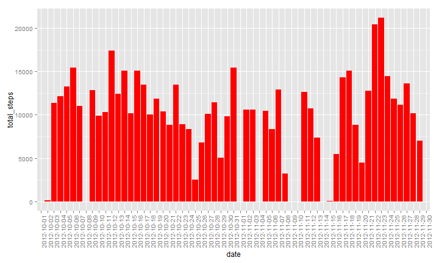
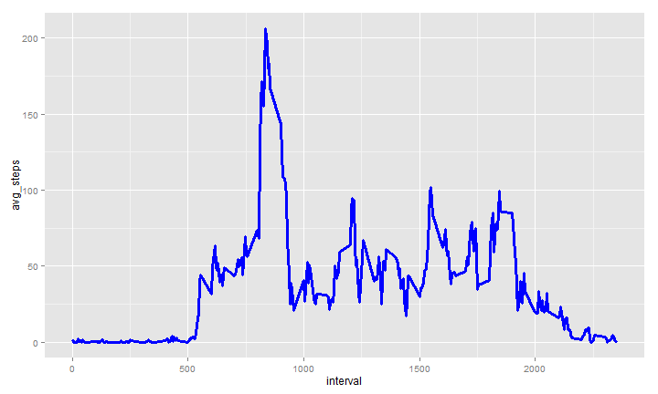
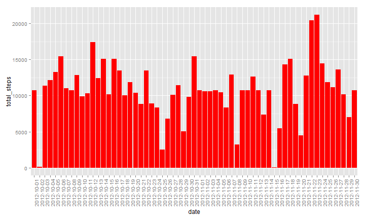
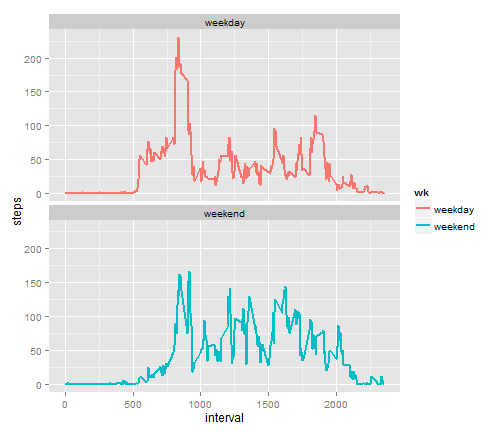

Reporducable Research - PA1
========================================================

### These commands read in the raw data from a .zip file in the working directory.


```r
setwd('D:/Documents/DS/RepResearch/New folder/RepData_PeerAssessment1')
unzip('activity.zip',list=T)
```

```
##           Name Length                Date
## 1 activity.csv 350829 2014-02-11 10:08:00
```

```r
unzip('activity.zip',list=F)
act <- read.csv('activity.csv')
```

### Summary of the datafile.


```r
summary(act)
```

```
##      steps                date          interval     
##  Min.   :  0.00   2012-10-01:  288   Min.   :   0.0  
##  1st Qu.:  0.00   2012-10-02:  288   1st Qu.: 588.8  
##  Median :  0.00   2012-10-03:  288   Median :1177.5  
##  Mean   : 37.38   2012-10-04:  288   Mean   :1177.5  
##  3rd Qu.: 12.00   2012-10-05:  288   3rd Qu.:1766.2  
##  Max.   :806.00   2012-10-06:  288   Max.   :2355.0  
##  NA's   :2304     (Other)   :15840
```

```r
head(act)
```

```
##   steps       date interval
## 1    NA 2012-10-01        0
## 2    NA 2012-10-01        5
## 3    NA 2012-10-01       10
## 4    NA 2012-10-01       15
## 5    NA 2012-10-01       20
## 6    NA 2012-10-01       25
```

### What is the mean number of steps taken per day?
- Aggregate steps by day
- Create historgram with ggplot2
- Print mean and median


```r
library(dplyr)
library(ggplot2)

#Aggregate data by day
act1 <- act %>%
        group_by(date) %>%
        summarize(total_steps = sum(steps,na.rm=T))

#histogram of total steps per day
ggplot(data=act1,aes(x=date,y=total_steps)) + geom_histogram(stat="identity", fill="red") + theme(axis.text.x = element_text(angle = 90, hjust = 1))
```

 

```r
#Mean total steps per day
mean(act1$total_steps)
```

```
## [1] 9354.23
```

```r
#Median total steps per day
median(act1$total_steps)
```

```
## [1] 10395
```

### What is the average daily activity pattern?
- Aggregate Steps by 5 minute interval
- Make a time series plot (type "l")
- Max Value of interval


```r
#Avg steps by interval
act2 <- act %>%
        group_by(interval) %>%
        summarize(avg_steps = mean(steps,na.rm=T))

#Time series of avg steps by interval
ggplot(data=act2,aes(x=interval,y=avg_steps)) + geom_line(lwd = 1.3, colour = "blue")
```

 

```r
#Max avg steps in interval
max(act2$avg_steps)
```

```
## [1] 206.1698
```

### Imputing missing values
Calculate and report the total number of missing values in the dataset (i.e. the total number of rows with NAs)

```r
sum(is.na(act$steps))
```

```
## [1] 2304
```

The imputation process will fill the NA values with the avg for that interval. It will use the dataset of step summarized by interval (act2) from the previous question to make the process easier.

```r
act.impute <- act

for (i in 1:length(act2$interval)){
        a <- act2[i,"interval"]
        act.impute[act.impute$interval==a & is.na(act.impute$steps),"steps"] <- act2[act2$interval==a,"avg_steps"]
        }  
```

Check number of NAs after imputation.  Should be zero.

```r
sum(is.na(act.impute$steps))
```

```
## [1] 0
```

Make a histogram of the imputed steps by day.

```r
#Aggregate data by day
act1.impute <- act.impute %>%
        group_by(date) %>%
        summarize(total_steps = sum(steps,na.rm=T))

#histogram of total steps per day
ggplot(data=act1.impute,aes(x=date,y=total_steps)) + geom_histogram(stat="identity", fill="red") + theme(axis.text.x = element_text(angle = 90, hjust = 1))
```

 

```r
#Mean total steps per day
mean(act1.impute$total_steps)
```

```
## [1] 10766.19
```

```r
#Median total steps per day
median(act1.impute$total_steps)
```

```
## [1] 10766.19
```
### What is the impact of imputing missing data on the estimates of the total daily number of steps?

The imputation process increased both the mean and median estimates.  Coincidentally, this also caused the mean to equal the median in this case.

### Are there differences in activity patterns between weekdays and weekends?
Create a variable to indicate whether weekend or weekday

```r
act.impute$date <- as.Date(act.impute$date,'%Y-%m-%d')
act.impute$wk <- "weekday"
act.impute$wk[weekdays(act.impute$date) %in% c('Saturday','Sunday')] <- "weekend"
```

Create a timeseires for weekday vs. weekend steps

```r
#Avg steps by interval, weekend
act3.impute <- aggregate(steps ~ interval + wk, data=act.impute,FUN=mean)

#Time series of avg steps by interval, weekend
ggplot(data=act3.impute,aes(x=interval,y=steps, colour=wk)) + geom_line(lwd = 1) + facet_wrap(~wk,nrow=2)
```

 

Weekdays appear to have a higher peak of steps during intervals in the morning whereas weekends have more cosistent intervals thoughout the day.
